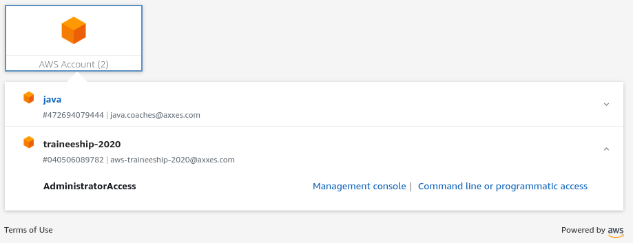
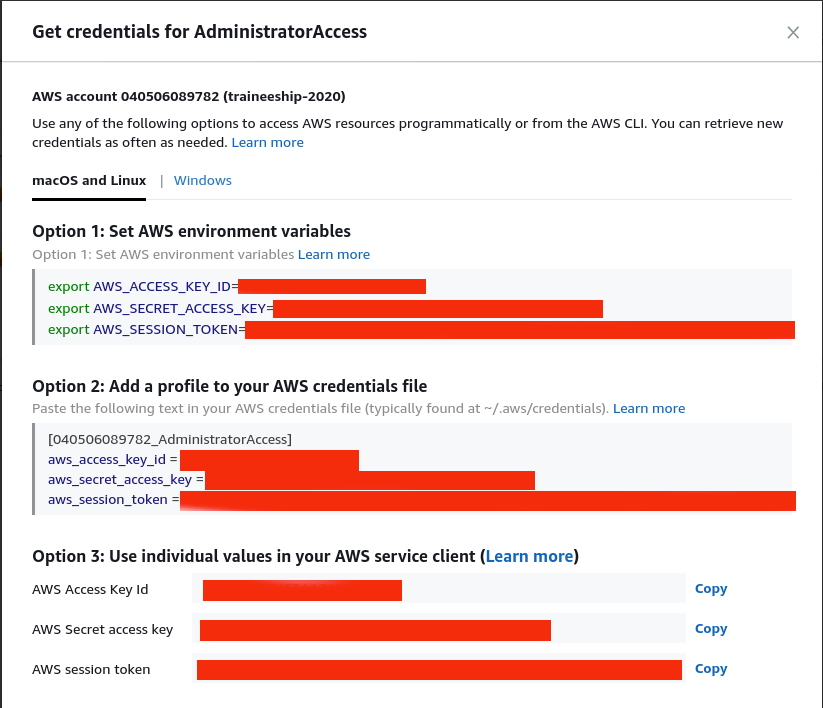

# Introduction

## AWS CLI
### Installing the CLI
Follow instruction in [the documentation](https://docs.aws.amazon.com/cli/latest/userguide/cli-chap-install.html)
> Feel free to choose between V1 and V2. I've only used V1, the features in V1 should work the same in V2, but I don't know for sure. 

### Getting credentials


Click `Command line or programmatic access`



### Testing the credentials
```bash
$ aws sts get-caller-identity
```
