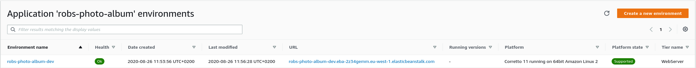
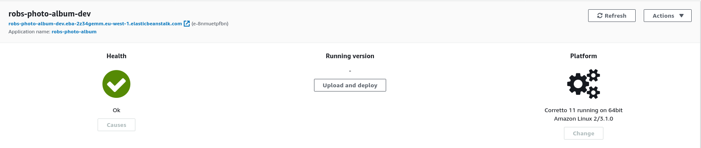
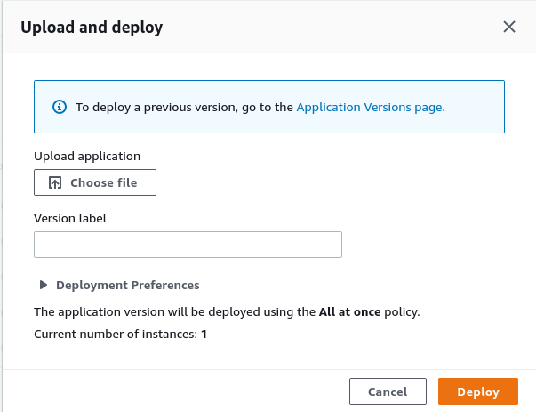
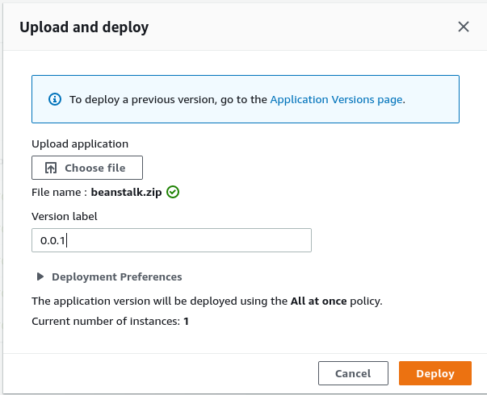

# 1. Elastic Beanstalk

## Setting up infrastructure
Create a beanstalk environment using [CloudFormation](https://eu-west-1.console.aws.amazon.com/cloudformation/home).
> You can pick any region you want, but you'll have to stay with the same region for all labs. My preference is eu-west-1.

The stack includes:
- Beanstalk Application
- Beanstalk Environment
- Required IAM roles
- [Service role](https://docs.aws.amazon.com/elasticbeanstalk/latest/dg/iam-servicerole.html) for Beanstalk

### Testing the environment
Go to the URL of your environment, it should show a page with 'Congratulations'. If not, don't worry yet, your application 
might still be provisioning.

## Building the java application
There's a maven project under application/, that directory also includes `build.sh` that will take all the steps
to create an application that can be deployed to beanstalk.
The script will:
- Create a jar using `mvn package`
- Create a zip file that included the jar and a [Procfile](https://docs.aws.amazon.com/elasticbeanstalk/latest/dg/java-se-procfile.html). TLDR: A Procfile list all
the processes that should run on startup.
> The application is written in Java 11. No idea how hard it will break when you use another version, but just a heads up.

## Deploying the application

Click `Upload and deploy`, this will open the following window.

Upload your *zip* file and enter a version label, so it looks like the following picture.

Click `Deploy` and wait a second. This takes a while because it needs to upload the zip file. Sometimes it takes a stupid
amount of time, but don't worry.

## Testing your application
Go back to the URL you clicked previously that should "Congratulations". When you add `/actuator/heatlh`, it should show 
the well-know response from Spring Actuator.
