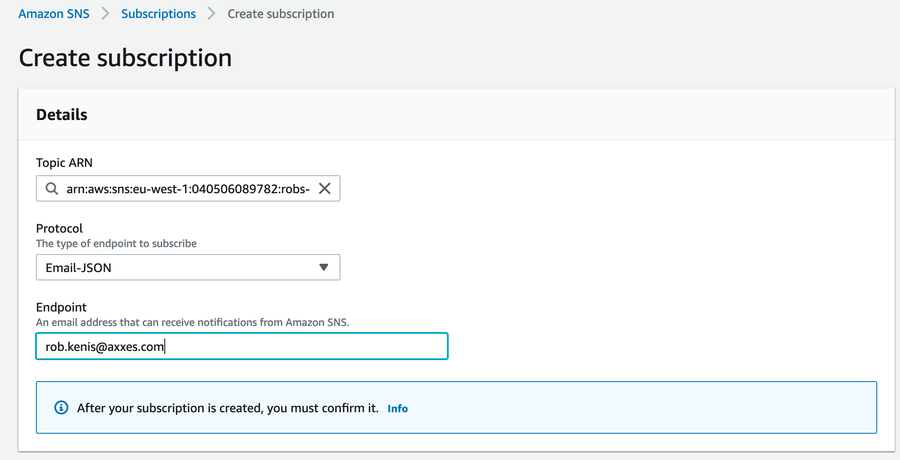
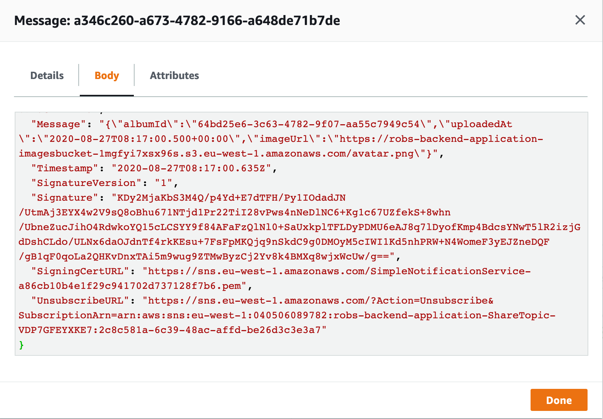

# 5. Messaging

Update your CloudFormation stack with the template in cloudformation/.
This will add an SNS topic and an SQS queue required for the next 2 steps.

## SNS
### Subscribing to SNS
Add a subscription to your topic. For now, we can just add our own e-mail address.
Later on, we will subscribe a queue so others can handle our messages.

After adding your email as a subscription, you will receive an email with the next steps
to complete the subscription.

### Sending to SNS
Implement `com.axxes.traineeship.photoalbum.share.ShareListenerImpl` to publish a message to SNS.

## SQS
Add a subscription to your topic, the required permissions are already set 
by the CloudFormation update.

If you did everything correctly, so:
- Publish the message to SNS
- Subscribe your email to the topic
- Subscribe the SQS to the topic

you should receive an email when an image is added to an album **and**
you should see a message on the queue.

### Consuming from SQS
Implement `com.axxes.traineeship.photoalbum.share.ShareConsumerImpl`. Jackson is already configured
to deserialize the messages from SQS.

Create a new album "shared". Add all the received images to that album.

## Sharing images
Subscribe the queues of your colleagues to your topic. 
When you upload an image to an album, the message will be sent to all their
queues. 

Remove the subscription of your own queue, you don't need to share images
with yourself.

**Be careful with infinite loops, if you add an image to your shared album, don't resend a notification.**
